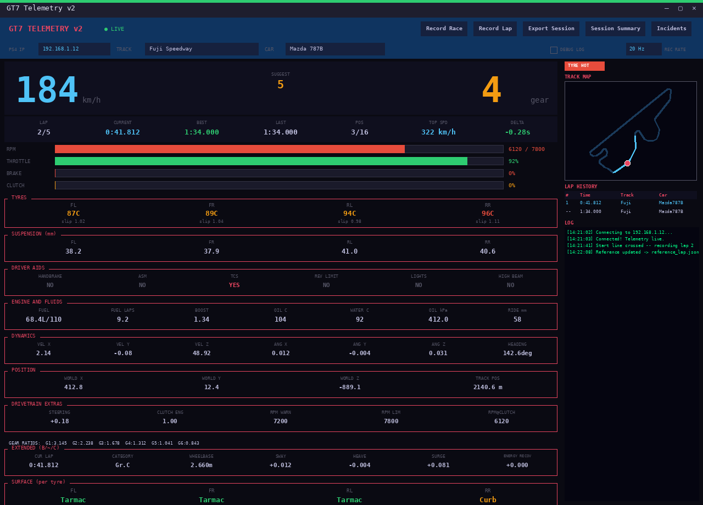
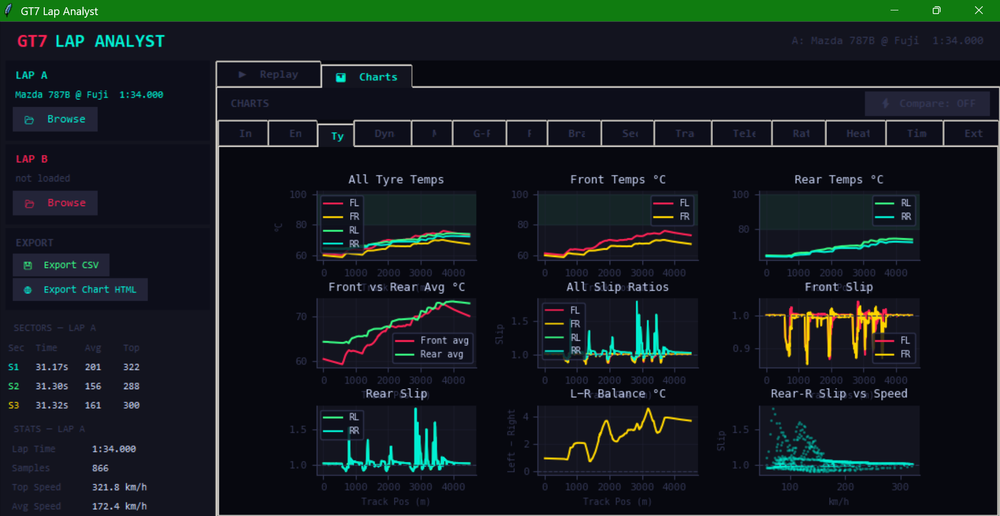

# TRACE — GT7 Telemetry Suite

**T**elemetry **R**acing **A**nalytics & **C**omparative **E**ngine

[](https://github.com/ransh2014/gt7telemtrace/actions/workflows/ci.yml)
[](https://pypi.org/project/gt7tracetelem/)
[](https://pypi.org/project/gt7tracetelem/)
[](https://pypi.org/project/gt7tracetelem/)
[](LICENSE)
[](https://github.com/ransh2014/gt7telemtrace/commits/main)

A live telemetry dashboard, lap analyst, and race analyst for **Gran Turismo 7** — reads the UDP telemetry stream straight off your PS4/PS5 over your local network. No mods, no jailbreak, just the game's own broadcast data, wrapped in three desktop tools you can install with one `pip install`.

Also published on PyPI as [`gt7tracetelem`](https://pypi.org/project/gt7tracetelem/) · Site: **[gt7trace.netlify.app](https://gt7trace.netlify.app)**

> Community tool — not affiliated with, endorsed by, or connected to Polyphony Digital or Sony Interactive Entertainment.

---

## Table of contents

- [Screenshots](#screenshots)
- [What's in the box](#whats-in-the-box)
- [Install](#install)
- [Quick start](#quick-start)
- [How it works](#how-it-works)
- [Public data API](#public-data-api)
- [Troubleshooting](#troubleshooting)
- [Contributing](#contributing)
- [Credits](#credits)
- [License](#license)
- [Support](#support)

---

## Screenshots

<!--
  Add real screenshots or a short GIF here before your next release — a PyPI/GitHub
  page for a GUI tool earns far more trust once people can see it before installing.
  Suggested shots: Live Dashboard mid-session, a Lap Analyst chart group (e.g. Braking
  or the Heat Maps track view), and the launcher menu.

  Drop images in a /docs or /assets folder and reference them like this:

  
  

  On PyPI, relative image paths only render if you set up a proper `Homepage`
  and the images are committed to the repo — GitHub raw URLs
  (https://raw.githubusercontent.com/ransh2014/gt7telemtrace/main/docs/...) are the
  safest choice since they work identically on both PyPI and GitHub.
-->
*(screenshots coming soon — see the [site](https://gt7trace.netlify.app) for a live preview in the meantime)*

---

## What's in the box

### Live Dashboard
- Real-time speed, RPM, gear, throttle/brake, tyre temps & slip
- Mini track map with live position
- Configurable recording sample rate (10/20/30/60 Hz)
- Live delta vs. a reference lap
- Connection diagnostics — heartbeats, packet loss, decrypt/parse failures, actionable error messages
- Remembers known-good PS4/PS5 IPs (up to 3, most recent first)
- Incident timeline
- Lap history table with alerts

### Lap Analyst
- **15 chart groups**: Inputs, Engine, Tyres, Dynamics, Maps, G-Force, Fuel, Braking, Sectors, Traction, Tele Diff, Ratings, Heat Maps, Timeline, Extended
- A/B lap comparison across every chart group
- Dual replay — synced and realtime
- Driver ratings radar
- Track-map heatmaps across 9 metrics (speed, throttle, brake, lateral/longitudinal/total G, tyre temp, RPM, steering)
- CSV and HTML chart export

### Race Analyst
- Same chart-group depth as Lap Analyst (15 groups, race-oriented: Race overview + Laps in place of Sectors + Extended)
- Race timeline, minimap heatmap, replay with speed control up to 32×

### Tooling
- `add_car.py` / `add_track.py` — add missing car/track IDs to the local database
- Ships with **580+ cars** and **120+ tracks** pre-resolved out of the box; the car database is refreshed every time 10 or more new cars have been added since the last update

---

## Install

### Option 1 — pip
```bash
pip install gt7tracetelem
```
The importable module is **`gt7telem`** (not `gt7tracetelem`) — the PyPI distribution name and the import name are different:
```python
import gt7telem
gt7telem.get_snapshot()
```
Or just run `gt7telem` from a terminal to launch the GUI menu.

> If you already have an unrelated package that installs a top-level `gt7telem` module, the two will conflict. Check first with `pip show gt7telem`.

### Option 2 — from source
Works on Windows, macOS, or Linux with Python 3.10+.
```bash
git clone https://github.com/ransh2014/gt7telemtrace.git
cd gt7telemtrace
pip install -e .
gt7telem
```

### Option 3 — standalone binaries
No Python required — grab a prebuilt Windows `.exe` or Linux binary from **[gt7trace.netlify.app/setup.html](https://gt7trace.netlify.app/setup.html)**.

---

## Quick start

1. In GT7, make sure telemetry broadcasting is available (it's on by default while a session/menu is active — no separate settings toggle needed).
2. Launch `gt7telem` (or run the source/binary).
3. Pick **Live Dashboard**, **Lap Analyst**, or **Race Analyst** from the menu.
4. Enter your console's IP in the Dashboard field and hit Enter — it's remembered for next time.
5. Recorded laps save to a `laps/` folder next to wherever you run it from.

Find your console's IP: **Settings → Network → View Connection Status** on your PS4/PS5. Your PC and console need to be on the same local network.

---

## How it works

TRACE talks directly to the console — no server, no browser, no cloud:

- A UDP **heartbeat** (`"C"`) is sent to `<console IP>:33739` roughly once a second, requesting GT7's fullest telemetry packet (the "extended" B + ~ + C fields — motion data, filtered inputs, and energy recovery all in one).
- GT7 streams packets back to your PC on port `33740`.
- Each packet is decrypted with Salsa20 and unpacked into a `Telemetry` snapshot — the protocol details this library relies on were reverse-engineered by [Bornhall](https://github.com/Bornhall/gt7telemetry) (see [Credits](#credits)).
- Because TRACE always requests the extended packet, you get motion/sway/heave/surge and filtered-input data automatically — there's no separate "heartbeat type" setting to configure.
- Settings (last-used IP, sample rate, known-good IPs) persist to a `settings.json` next to wherever you run TRACE from, so there's nothing to reconfigure between sessions.

---

## Public data API

```python
import gt7telem

gt7telem.set_ip("192.168.1.X")
gt7telem.wait_for_connection()

snap = gt7telem.get_snapshot()
print(gt7telem.get_car_name(snap))
print(gt7telem.get_diagnostics())   # heartbeat / packet-loss / decrypt status as a human-readable string
```

See `gt7telem.__all__` for the full list of exported functions (`get_snapshot`, `set_car`, `set_track`, `get_diagnostics`, `get_car_name`, `get_track_name`, `all_track_names`, settings persistence, and more). The GUI apps (`dashboard`, `lap_analyst`, `race_analyst`) are available as submodules for anyone building on top of TRACE directly:

```python
from gt7telem import dashboard
dashboard.App().mainloop()
```

---

## Troubleshooting

| Symptom | Likely cause |
|---|---|
| "Can't send heartbeat to `<ip>`:33739" | Wrong console IP, or PC/console aren't on the same network |
| Heartbeats sending but nothing comes back | Firewall is blocking inbound UDP on port `33740` — allow it for Python/the TRACE executable |
| Packets arriving but not decrypting | Something else is bound to port 33740, an unexpected console/game version, or a mid-stream corrupt packet (usually self-resolves) |
| A module named `gt7telem` already exists | You (or another package) installed an unrelated `gt7telem`; run `pip show gt7telem` to check before installing |
| Car/track shows as a blank name | The ID isn't in the local database yet — run `add_car.py` / `add_track.py`, or wait for the next scheduled DB refresh |

Live connection diagnostics (heartbeat count, packet loss, last error) are always visible in the Dashboard, and available programmatically via `gt7telem.get_diagnostics()`.

---

## Contributing

Issues and PRs are welcome — see [CONTRIBUTING.md](CONTRIBUTING.md) for the quick version (dev setup, where the GUI code lives, and how the car/track databases get refreshed).

---

## Credits

TRACE stands on the shoulders of two people who did the hard, unglamorous work this project depends on:

- **[Bornhall](https://github.com/Bornhall/gt7telemetry)** — reverse-engineered GT7's UDP telemetry protocol, including the Salsa20 decryption key and full packet byte structure. Every telemetry value TRACE reads comes from this work.
- **[ddm999](https://github.com/ddm999/gt7info)** — maintains [gt7info](https://ddm999.github.io/gt7info/), the community car and track database that resolves every car/track ID to a real name shown anywhere in TRACE.

Full writeup and credits: **[gt7trace.netlify.app/about.html](https://gt7trace.netlify.app/about.html)**.

## License

MIT — see [LICENSE](LICENSE).

## Support

TRACE is free and always will be. If it's improved your GT7 sessions, a coffee is appreciated: **[ko-fi.com/ransh](https://ko-fi.com/ransh)**.
